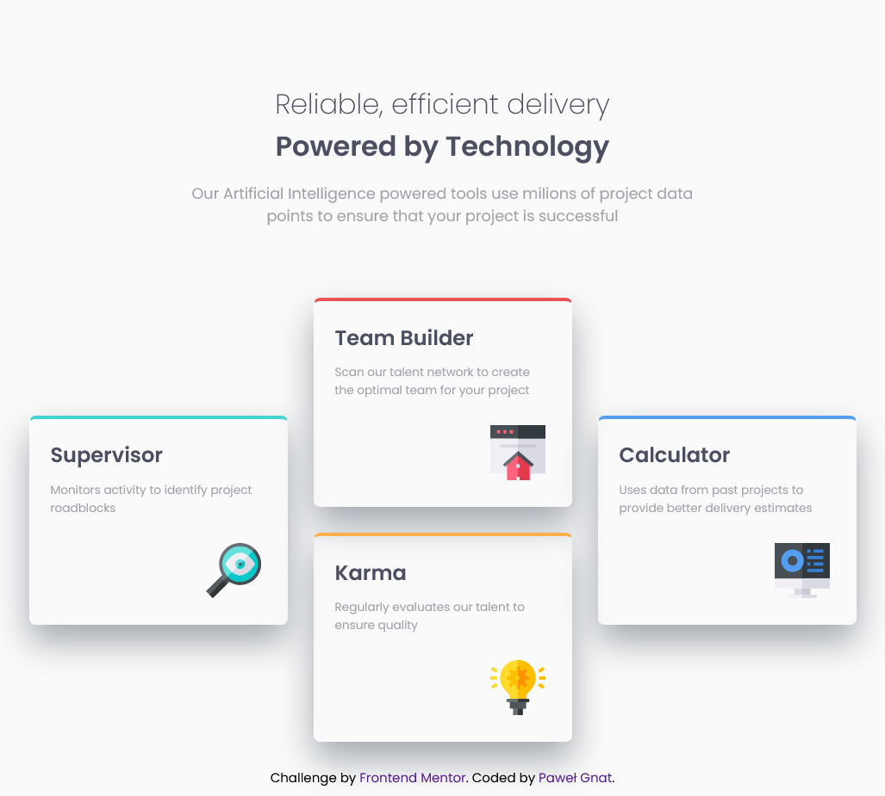

# Frontend Mentor - Four card feature section solution

This is a solution to the [Four card feature section challenge on Frontend Mentor](https://www.frontendmentor.io/challenges/four-card-feature-section-weK1eFYK). Frontend Mentor challenges help you improve your coding skills by building realistic projects.

## Table of contents

- [Overview](#overview)
  - [Screenshot](#screenshot)
  - [Links](#links)
- [My process](#my-process)
  - [Built with](#built-with)
  - [What I learned](#what-i-learned)
- [Author](#author)

## Overview

### Screenshot

### Links

- Live Site URL: [Four Card Feature Section](xx)

## My process

Simple task. Created divs with appropriate positioning, using flexbox.

### Built with

- Semantic HTML5 markup
- CSS custom properties
- Flexbox
- Mobile-first workflow

### What I learned

I managed to complete this challenge in 2 hours. I found this challenge quite simple. I had a chance to improve my flexbox skills.

## Author

- Frontend Mentor - [@Pawel-Gnat](https://www.frontendmentor.io/profile/Pawel-Gnat)
